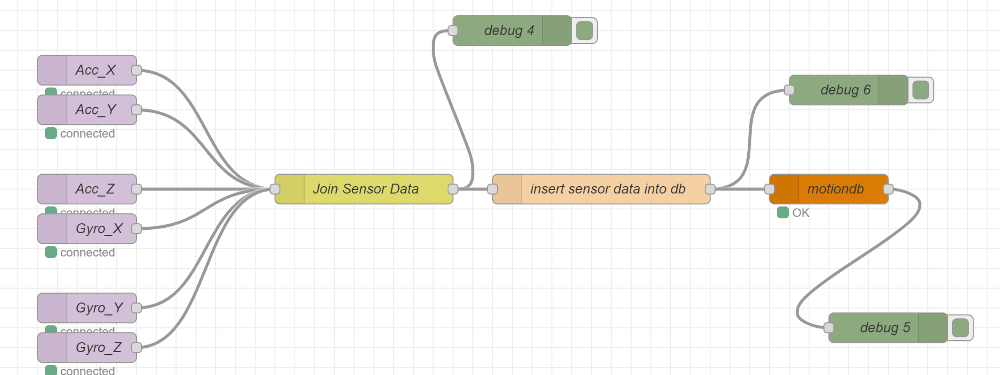
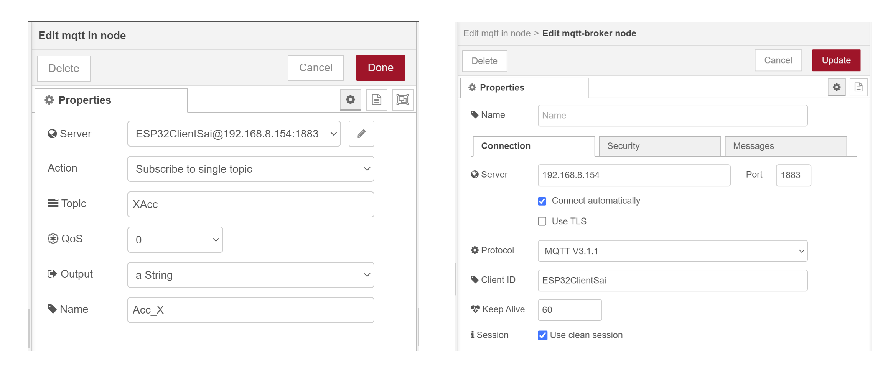
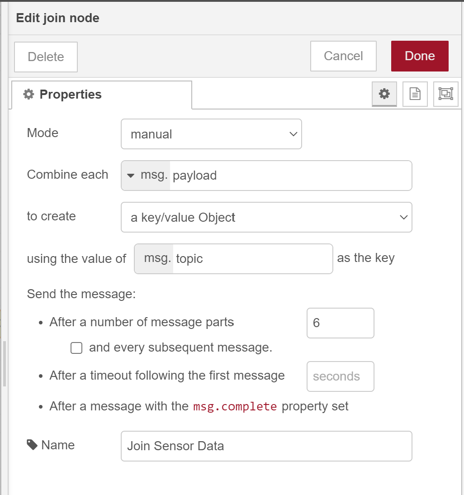
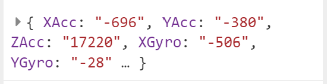
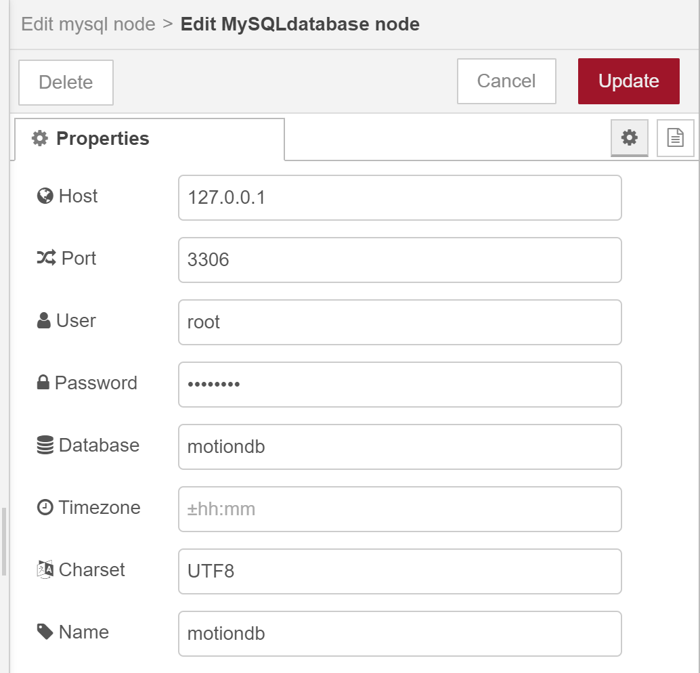

### What is Node Red
Node red is a Open Source flow based tool and IOT platform and Dashboard developed by IBM and written in Node.js.

Node-red lets you easily build applications by joining together black box functions (nodes) using a web interface, and it requires very little, if any, programming knowledge.

Because of its flexibility and ease of use node-red is ideally suited for building IOT and Home control dashboards and automations as well as many other applications.

### Installation and running
Download and setup the node-red from [Nodered windows installation instructions](https://nodered.org/docs/getting-started/windows)

### Creating Node-Red Flow
With Node-RED running, open the editor in a web browser.

If you are using a browser on the same computer that is running Node-RED, you can access it with the url: http://localhost:1880.

### Project Node-Red Flow

 

### Nodes used:

**1. MQTT in**

To connect to an MQTT broker running locally we use MQTT input node

setup the mqtt in node by specifying the MQTT server details like client name(ESP32ClientSai), client IP address, port number, topic name

 


**2. Join**

since we gave each stream a unique msg.topic value in mqtt in nodes and use the Join node to group them into a single message.

 

I chose the key value object so that, value can be inserted into database based on key. Key value pairs of sensor data looks like below
 

**3. Function Node**

I performed MYSQL insert query in the function operation to insert the sensor data into DB.

```
msg.topic = "INSERT INTO mpudata1(XAcc,YAcc,ZAcc,XGyro,YGyro,ZGyro) VALUES ('" + msg.payload["XAcc"] + "','" + msg.payload["YAcc"] + "','" + msg.payload["ZAcc"] + "','" + msg.payload["XGyro"] + "','" + msg.payload["YGyro"] + "','" + msg.payload["ZGyro"] + "')";
return msg;
```

**4. MYSQL node**

MYSQL node is used to connect to MYSQL server by specifying the MYSQL details like server address, port number, database name, username and password

 

