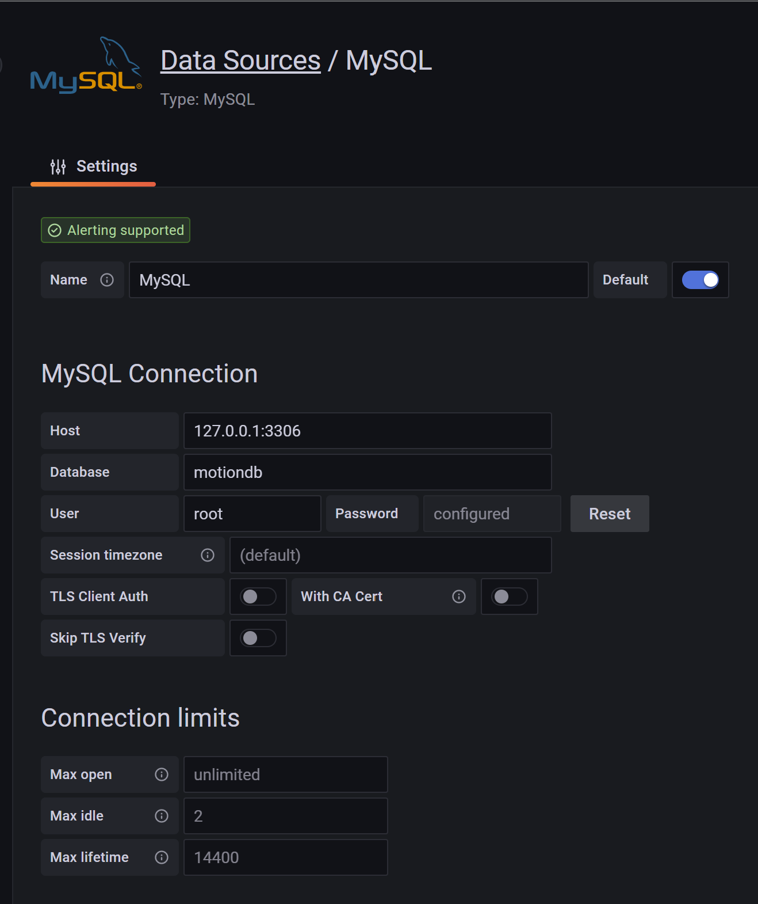
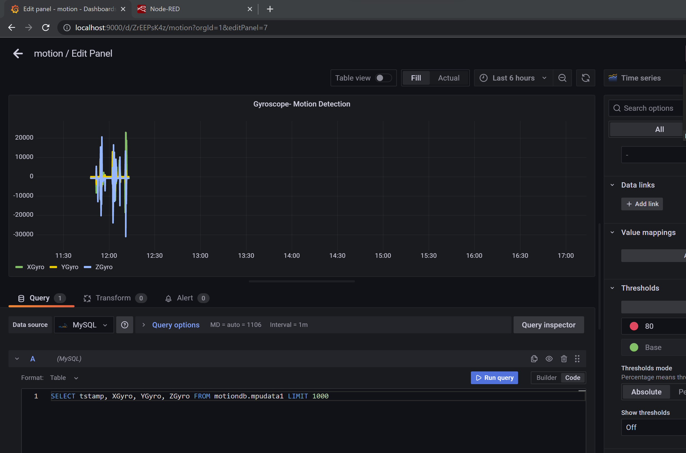

## Grafana

Grafana open source software enables you to query, visualize, alert on, and explore your metrics, logs, and traces wherever they are stored.

### Installation and setup

Download the grafana server from [Grafana Download](https://grafana.com/grafana/download?pg=get&plcmt=selfmanaged-box1-cta1&platform=windows)

Unzip the package, navigate to bin folder run the  _grafana-server.exe_.

Type `http://localhost:9000` or `http://localhost:3000` (depending upon the port number configured in defaults.ini file) to open Grafana in web browser

Grafana has some bug in its login webpage. The default credentails are Username : admin and Password: admin. However when yo try to sign in with the defaults credentials it throws an error saying **Error while signing in**. So I tweaked the config file to skip the initial login page by chnaging the below statements in the defaults.ini file.

```
[auth.anonymous]
enabled = true    // allow anonymous login
[auth]
disable_login_form = true // disable login form
```
Once you are in without login page. You can now sign in and change the default password from the welcome page.

Now connect to MySQL database by navigating to left main menu **Configuration --> Data sources** and specify the MYSQL server details as below

 

### Creating Dashboards:
Once the datasource is setup you can navigate to left main menu **Dashboard --> New Dashboard --> Add new Panel**

You can already see your MYSQL server showing as the datasource below.

Choose a suitable visualization(Time series, bar graph, guage...), add a panel title, build a query and run it to see the visual represesntation of sensor data.

I used the timeseries graph to visualize the data

 


