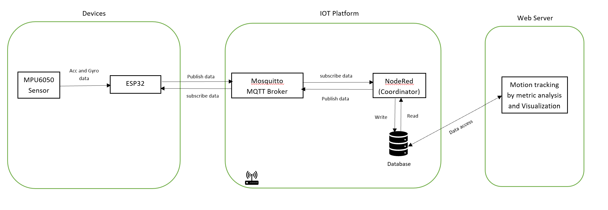
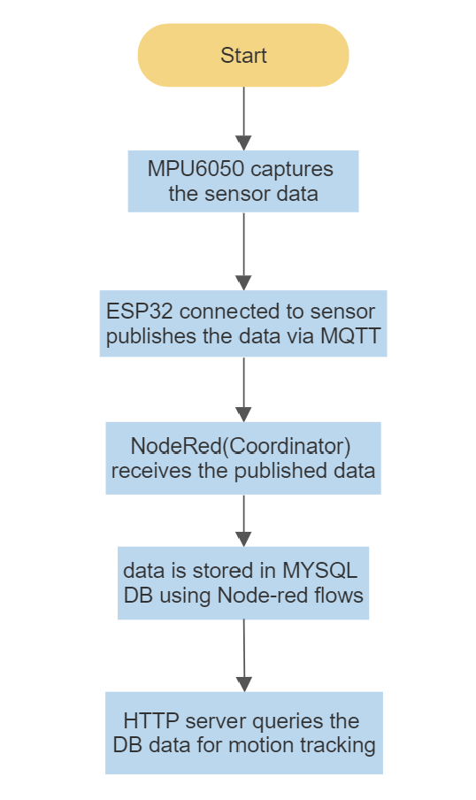
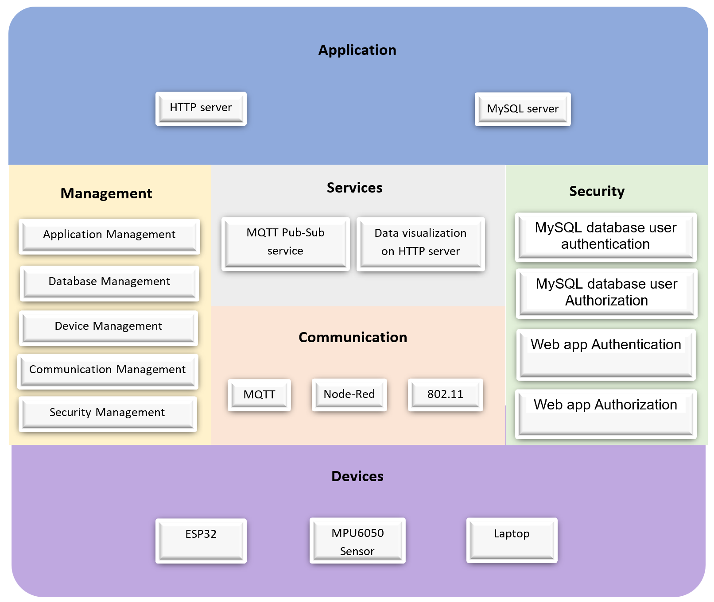

# Motion tracking system
### Author - Sunil Kumar Gummalla

This Github page contains the tutorial and codebase of the project "Motion tracking system". 

## Overview of Smart Building:
A smart building is one that makes use of technology to provide residents with a safe and comfortable environment while enabling efficient and economical resource use. By connecting building operations through the Internet of Things (IoT), smart buildings make it easier to monitor building temperature, security, and maintenance via computers and mobile devices. A wide variety of current technologies may be used in smart buildings, which are also built or renovated to allow for the incorporation of emerging technology. Building management systems, artificial intelligence (AI), augmented reality, and Internet of Things (IoT) sensors are a few of the robotics and processes that can be utilized in a smart building to regulate and enhance its performance.

## Main Objective of this project
  - Develop a prototype sensor system with ESP32 and MPU6050 which can publish/send the acceleration and gyroscope 6 axial data via MQTT.
  - Subscribe for the data and store it in MYSQLDB using Node Red
  - Monitor the 6 axial (3-axis gyroscope and a 3-axis accelerometer) data on HTTP Web server - GRAFANA

### 1. Introduction

Motion capture is the process of recording the movement of objects or people.  In many fields, motion capture is sometimes called motion tracking. Motion tracking  in  dynamic  environment  has drawn much attention nowadays. Motion tracking assists in tracking the movement of objects and transferring the sensed data to an application for further processing. This has a wide range of applications such as in military, entertainment, sports, medical applications, validation of computer vision and robotics. This motion tracking system can also help to detect intrusions at homes or any commercial building with proper implementation. Tracking  of  multiple  targets  at  the  same  time  is  an important issue in a wide variety of fields recently. However, for my part of implementation, I developed a prototype sensor system which can help in the axial monitoring system which detects the parameters and shares it to user through MQTT and can be monitored on web application 

### 2. Components

- **Devices:** MPU6050 accelerometer and gyroscope sensor, ESP32 and a laptop
- **IOT Platform:** connected over WiFi
  - **MQTT broker:** Mosquitto MQTT broker running on localhost
  - **Coordinator:** Node-red flow is used to pass messages between the nodes like MQTT broker and database. It receives the messages from sensors and send the messages to database
  - **Database:** MySQL database is used to store the accelerometer and gyroscope readings. It is accessed for motion tracking on web application

- **Webserver:** Webserver like HTTP Grafana webserver which is connected to a data source can be used for motion tracking by performing metric analysis and data visualization

#### 3. Enterprise architecture
 

### 4. Process Specification

### 5. Funtional view specification

